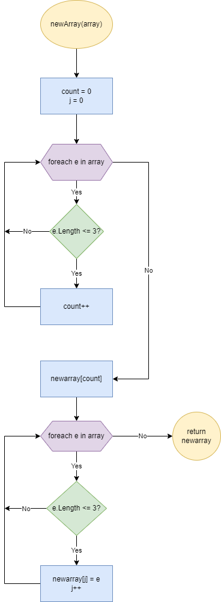

# Итоговая контрольная работа по основному блоку

### Задача:
*Написать программу, которая из имеющегося массива строк формирует новый массив из строк, длина которых меньше, либо равна 3 символам. Первоначальный массив можно ввести с клавиатуры, либо задать на старте выполнения алгоритма. При решении не рекомендуется пользоваться коллекциями, лучше обойтись исключительно массивами.*

Код состоит из двух частей:
1. Функция **newArray**
2. Основная часть

### Алгоритм для **newArray**:

### Упрощенный порядок действий:
1. Проверяем кол-во подходящих нам элементов в массиве **array**, чтобы понять размер нового массива.
2. Записываем кол-во в переменную **count**.
3. Создаем новый массив **newarray** размерностью **count**.
4. Перебираем массив **array** и записываем подходящие элементы в массив **newarray**.

Ссылка на репозиторий: [github](https://github.com/B1ackScorpion/Main_test_1.git "Main_test_1")